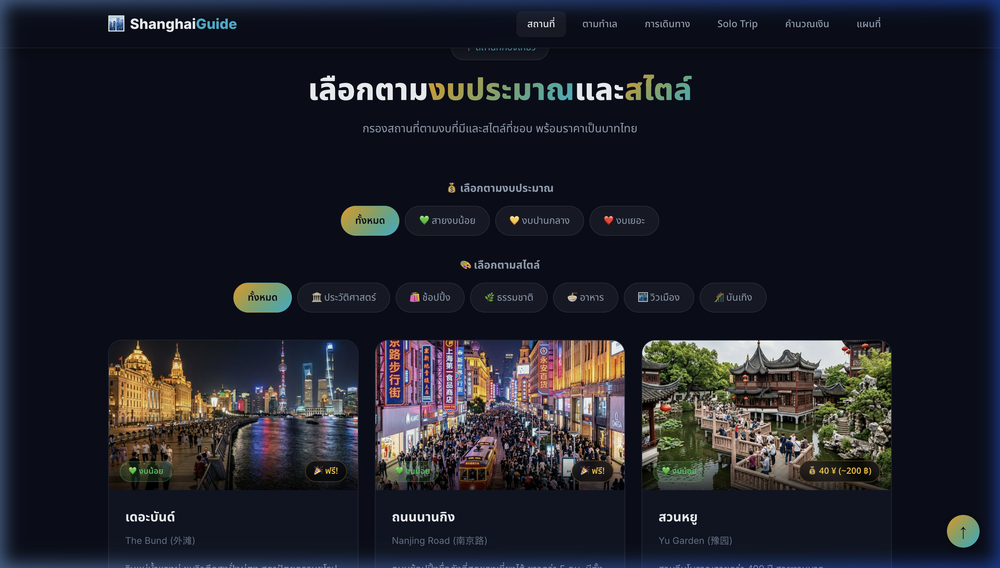
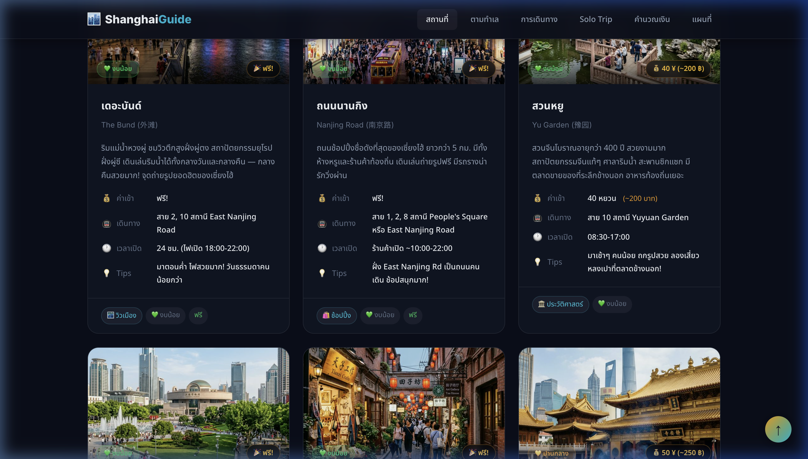
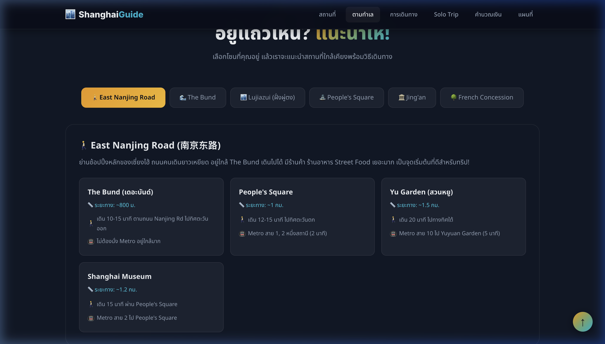
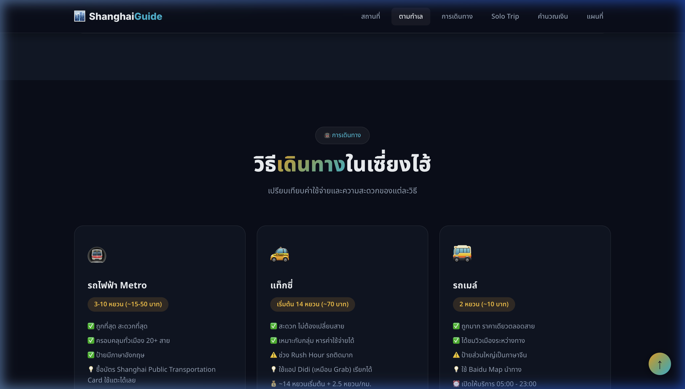
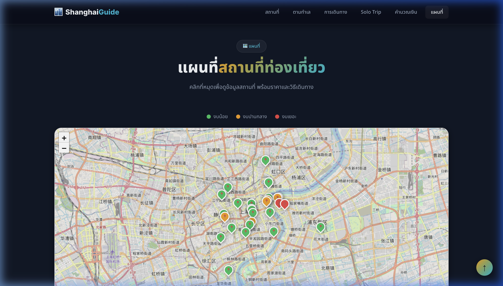
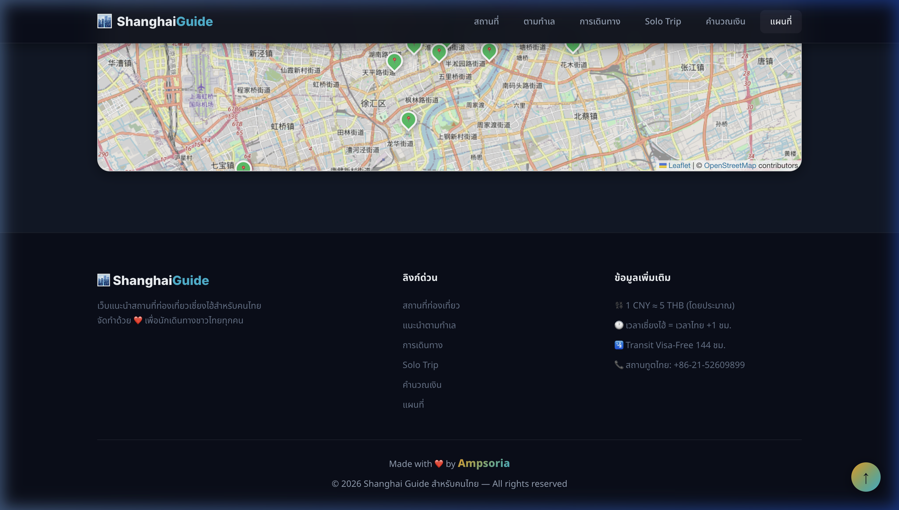

# 🇨🇳✈️ Shanghai Guide สำหรับคนไทย

> เว็บแนะนำสถานที่ท่องเที่ยวเซี่ยงไฮ้ ฉบับคนไทย — จัดตามงบ จัดตามสไตล์ พร้อมแผนที่ วิธีเดินทาง และราคาเป็นบาทไทย


---

## 📌 เกี่ยวกับโปรเจกต์

เว็บไซต์ Static สำหรับนักท่องเที่ยวชาวไทยที่ต้องการเที่ยวเซี่ยงไฮ้ ออกแบบมาสำหรับ **Solo Trip** โดยเฉพาะ มีข้อมูลครบถ้วนจบในเว็บเดียว ✨

### ✨ Features หลัก

| Feature | รายละเอียด |
|---------|-----------|
| 📍 **30+ สถานที่ท่องเที่ยว** | พร้อมรูปภาพจริง ราคา วิธีเดินทาง Tips |
| 💰 **กรองตามงบ** | สายงบน้อย / ปานกลาง / งบเยอะ |
| 🎨 **กรองตามสไตล์** | ประวัติศาสตร์ / ช้อปปิ้ง / ธรรมชาติ / อาหาร / วิวเมือง / บันเทิง |
| 📌 **แนะนำตามทำเล** | เลือกโซนที่อยู่ แนะนำสถานที่ใกล้เคียง |
| 🗺️ **แผนที่ Interactive** | Leaflet.js พร้อมหมุดสีแยกตามงบ |
| 💱 **คำนวณเงิน** | แปลงหยวน → บาท พร้อมราคาที่ใช้บ่อย |
| 🎒 **คู่มือ Solo Trip** | แอพที่ต้องมี ความปลอดภัย งบ/วัน เตรียมตัว |
| 📱 **Responsive** | รองรับ PC, Tablet, iPhone ทุกขนาดหน้าจอ |

---

## 🎬 Demo

### 🏠 Hero Section
หน้าแรกที่ดึงดูดสายตา พร้อมสถิติ 30+ สถานที่ 3 ระดับงบ 7 สไตล์


---

### 📍 สถานที่ท่องเที่ยว — ระบบกรอง
กรองสถานที่ตามงบประมาณและสไตล์ที่ชอบ



---

### 🖼️ การ์ดสถานที่พร้อมรูปภาพจริง
แต่ละการ์ดมีรูปภาพ ราคา วิธีเดินทาง เวลาเปิด-ปิด และ Tips



---

### 📌 แนะนำตามทำเล
เลือกโซนที่คุณพัก แนะนำสถานที่ใกล้เคียงพร้อมวิธีเดินทาง



---

### 🚇 วิธีเดินทาง
เปรียบเทียบ Metro, แท็กซี่, รถเมล์, เดินเท้า, Didi, เรือข้ามฟาก



---

### 🗺️ แผนที่ Interactive
แผนที่ Leaflet.js แสดงตำแหน่งสถานที่ทั้งหมด หมุดสีแยกตามระดับงบ



---

### 🔻 Footer
ลิงก์ด่วน ข้อมูลเพิ่มเติม พร้อมเครดิต



---

## 🛠️ เทคโนโลยีที่ใช้

| Technology | Purpose |
|-----------|---------|
| HTML5 | โครงสร้างเว็บ |
| CSS3 | ดีไซน์ Dark Theme + Glassmorphism |
| Vanilla JavaScript | Logic ทั้งหมด (กรอง, แนะนำ, คำนวณ) |
| Leaflet.js | แผนที่ Interactive |
| Google Fonts | Typography (Inter + Noto Sans Thai) |

---

## 📁 โครงสร้างโปรเจกต์

```
Shanghai_Tourism/
├── index.html          # หน้าเว็บหลัก
├── style.css           # CSS ทั้งหมด (Design System + Responsive)
├── script.js           # JavaScript (ข้อมูล 30 สถานที่ + Logic)
├── images/             # รูปภาพสถานที่ท่องเที่ยว (19 รูป)
│   ├── the_bund.jpg
│   ├── nanjing_road.jpg
│   ├── yu_garden.jpg
│   ├── shanghai_tower.jpg
│   ├── oriental_pearl_tower.jpg
│   ├── shanghai_disneyland.jpg
│   └── ... (19 files)
├── screenshots/        # Screenshots สำหรับ README
│   ├── hero.png
│   ├── attractions.png
│   ├── location.png
│   └── ...
└── README.md           # ไฟล์นี้
```

---

## 🚀 วิธีใช้งาน

1. Clone หรือ Download โปรเจกต์
```bash
git clone https://github.com/yourusername/Shanghai_Tourism.git
```

2. เปิดไฟล์ `index.html` ในเบราว์เซอร์
```bash
open index.html
```

> 💡 ไม่ต้องติดตั้งอะไรเพิ่มเติม เป็น Static Website 100%

---

## 📱 Responsive Design

รองรับทุกขนาดหน้าจอ:

| Breakpoint | Device |
|-----------|--------|
| `> 768px` | 💻 Desktop |
| `≤ 768px` | 📱 Tablet |
| `≤ 480px` | 📱 iPhone |
| `≤ 375px` | 📱 iPhone SE / Mini |

---

## 👤 ผู้จัดทำ

**Made with ❤️ by Ampsoria**

© 2026 Shanghai Guide สำหรับคนไทย — All rights reserved
