# 🇨🇳✈️ Shanghai Guide สำหรับคนไทย

> เว็บแนะนำสถานที่ท่องเที่ยว ร้านอาหาร เคล็ดลับ และภาษาจีนสำหรับเที่ยวเซี่ยงไฮ้ ฉบับคนไทย จัดตามงบ จัดตามสไตล์ พร้อมแผนที่ วิธีเดินทาง ราคาเป็นบาทไทย

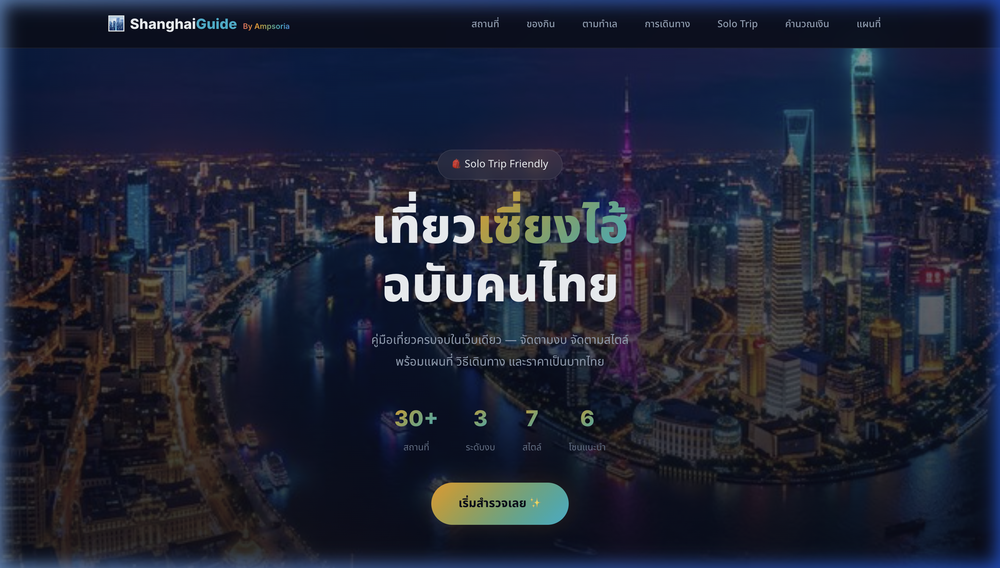

---

## 📌 เกี่ยวกับโปรเจกต์

เว็บไซต์ Static สำหรับนักท่องเที่ยวชาวไทยที่ต้องการเที่ยวเซี่ยงไฮ้ ออกแบบมาสำหรับ **Solo Trip** โดยเฉพาะ มีข้อมูลครบถ้วนจบในเว็บเดียว ✨

### ✨ Features ทั้งหมด

| Feature | รายละเอียด |
|---------|-----------|
| 📍 **30+ สถานที่ท่องเที่ยว** | พร้อมรูปภาพจริง ราคา วิธีเดินทาง Tips |
| 🍜 **15 ร้านอาหารแนะนำ** | Street Food, ร้านดัง, Fine Dining พร้อมเมนูต้องสั่ง |
| 📋 **แพลนเที่ยว 3/5 วัน** | Itinerary จัดไว้ให้แล้ว พร้อมค่าใช้จ่าย |
| 🗣️ **ภาษาจีน 52 ประโยค** | 10 หมวด + ระบบแปลไทย→จีน พร้อมคำอ่าน |
| 💡 **Tricks & Tips** | เคล็ดลับ VPN, Alipay, มารยาท, ถ่ายรูป |
| 🛂 **ข้อมูลวีซ่า** | Transit Visa-Free 144 ชม. ครบทุกเงื่อนไข |
| 🌸 **เที่ยวตามฤดูกาล** | อากาศ ไฮไลท์ คะแนนแนะนำ ทั้ง 4 ฤดู |
| 📱 **แอพจำเป็น 8 ตัว** | Alipay, Baidu Maps, DiDi, WeChat + อื่นๆ |
| ✅ **Checklist เตรียมตัว** | กดเช็คได้ จำให้อัตโนมัติ มี Progress Bar |
| 💰 **ประมาณงบรายวัน** | 3 สไตล์: ประหยัด / สบายๆ / หรูหรา |
| ⏳ **นับถอยหลัง** | ใส่วันเดินทาง ระบบนับถอยหลังให้ |
| 💱 **คำนวณเงิน** | แปลงหยวน → บาท พร้อมราคาที่ใช้บ่อย |
| 🗺️ **แผนที่ Interactive** | Leaflet.js พร้อมหมุดสีแยกตามงบ |
| 📱 **Responsive** | รองรับ PC, Tablet, iPhone ทุกขนาด |

---

## 🎬 Demo

### 🏠 Hero Section


---

### 📍 สถานที่ท่องเที่ยว
กรองได้ตามงบประมาณและสไตล์

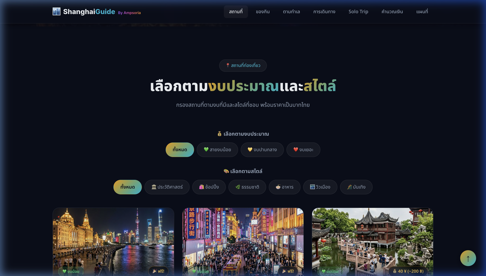

---

### 🍜 ของกิน & ร้านอาหาร
15 ร้าน จัดตามงบ (ถูก / ปานกลาง / หรู)

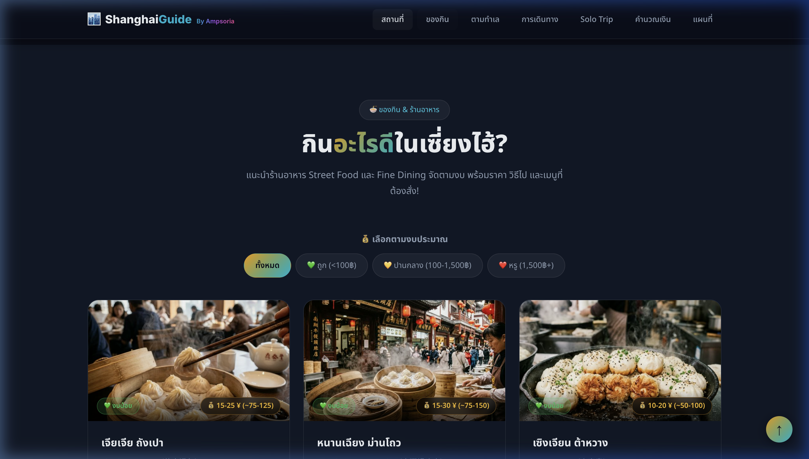
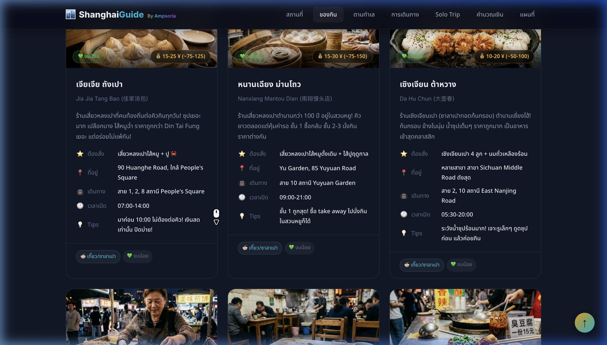

---

### 📋 แพลนเที่ยว 3/5 วัน
สลับ tab ได้ พร้อมค่าใช้จ่ายแต่ละมื้อ

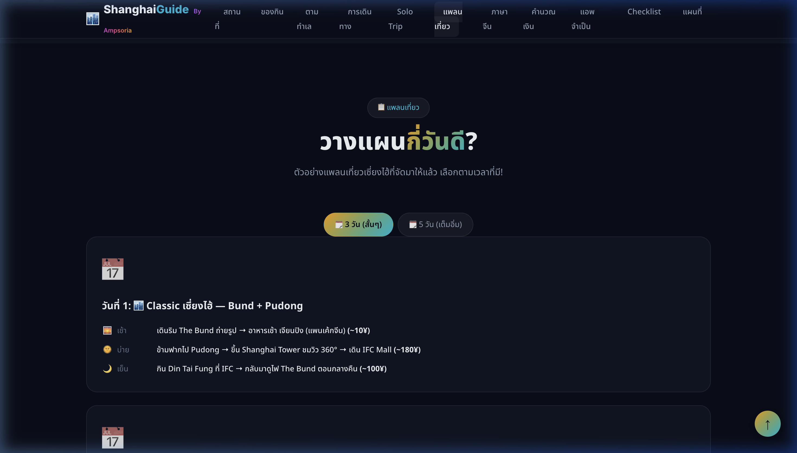

---

### 🗣️ ภาษาจีน + ระบบแปล
52 ประโยค 10 หมวด + พิมพ์ไทยแปลจีนได้เลย

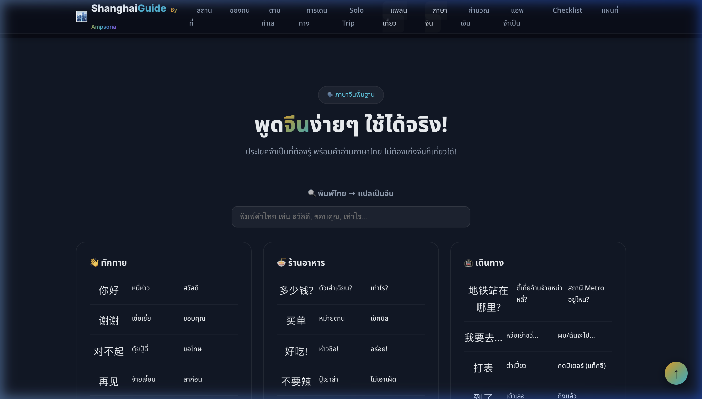

---

### 💡 Tricks & Tips
8 หมวดเคล็ดลับจากคนไปมาแล้ว

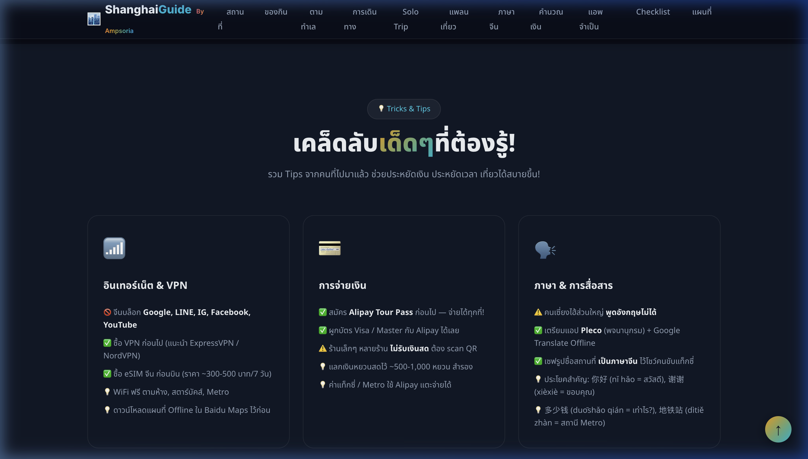

---

### 🛂 วีซ่า Transit Visa-Free 144 ชม.
เงื่อนไข เอกสาร วิธีนับเวลา ข้อห้าม

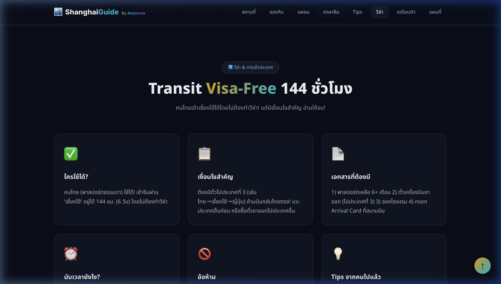

---

### 🌸 เที่ยวตามฤดูกาล
อากาศ ไฮไลท์ คะแนนแนะนำ ทั้ง 4 ฤดู

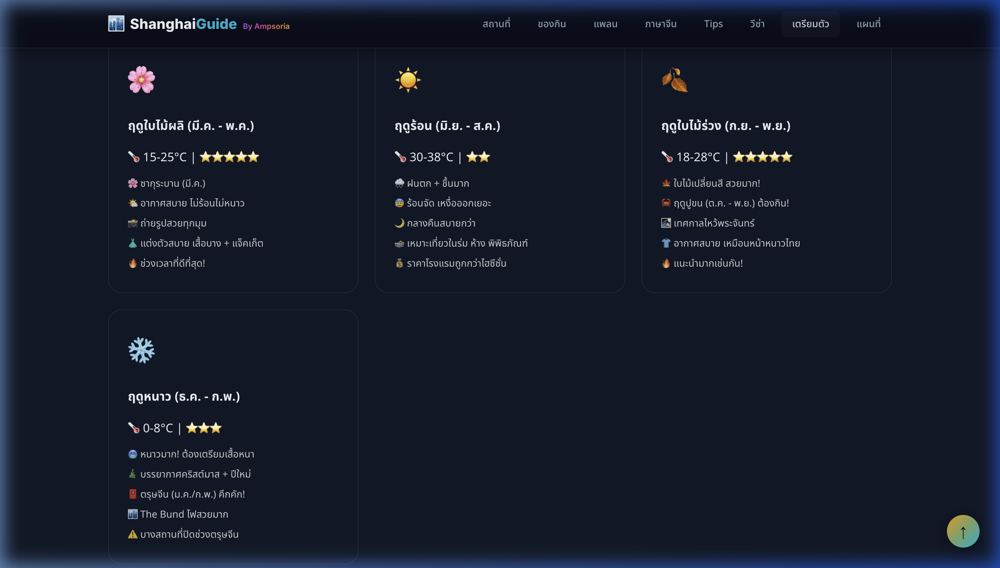

---

### 📱 แอพจำเป็น
8 แอพที่ต้องโหลดก่อนบิน

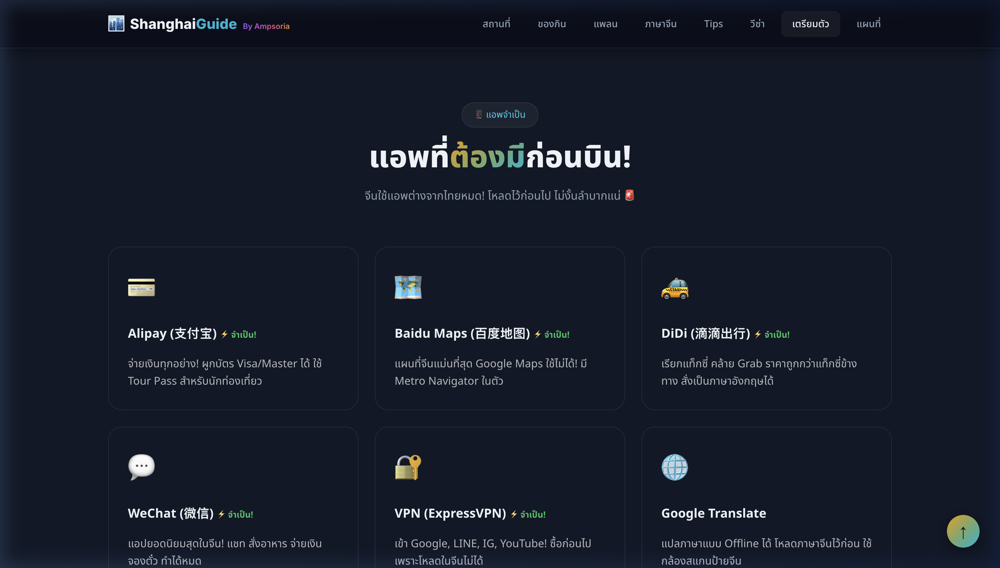

---

### ✅ Checklist เตรียมตัว + 💰 ประมาณงบ

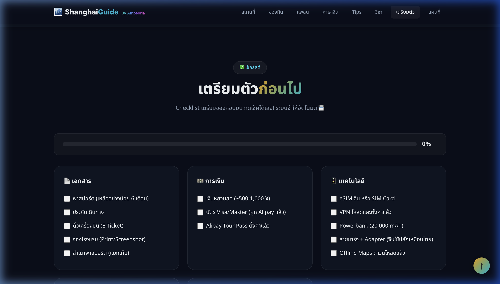
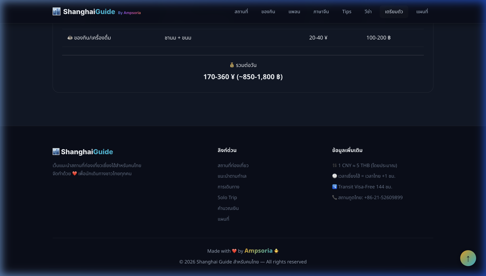

---

### 📌 แนะนำตามทำเล + 🚇 เดินทาง
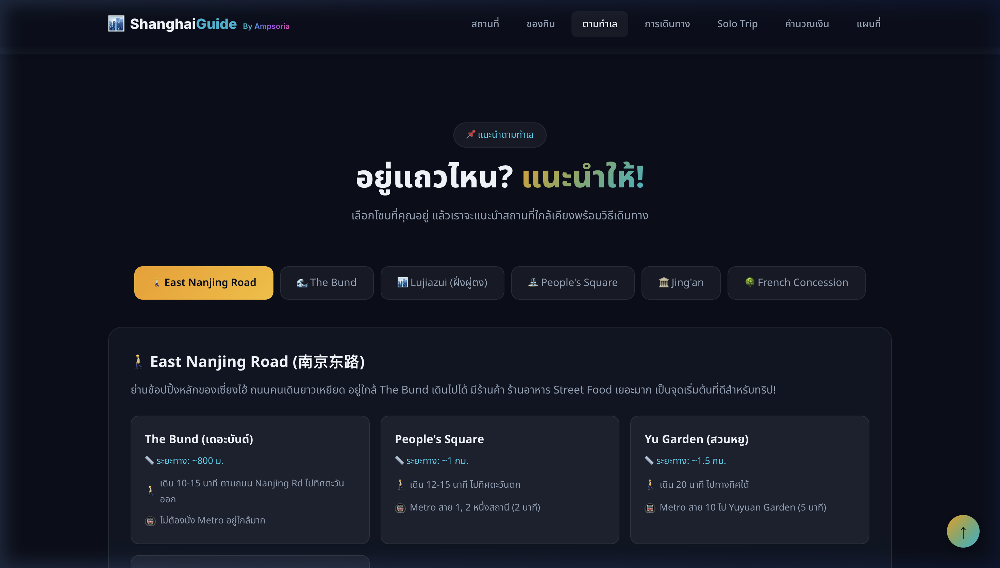
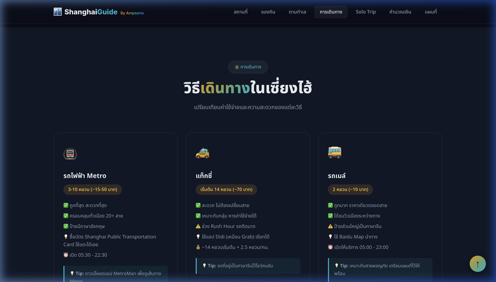

---

### 🗺️ แผนที่ + 🔻 Footer
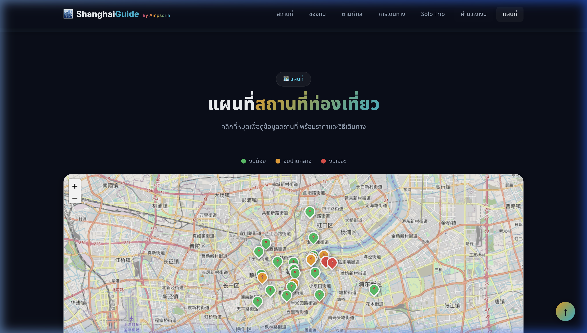
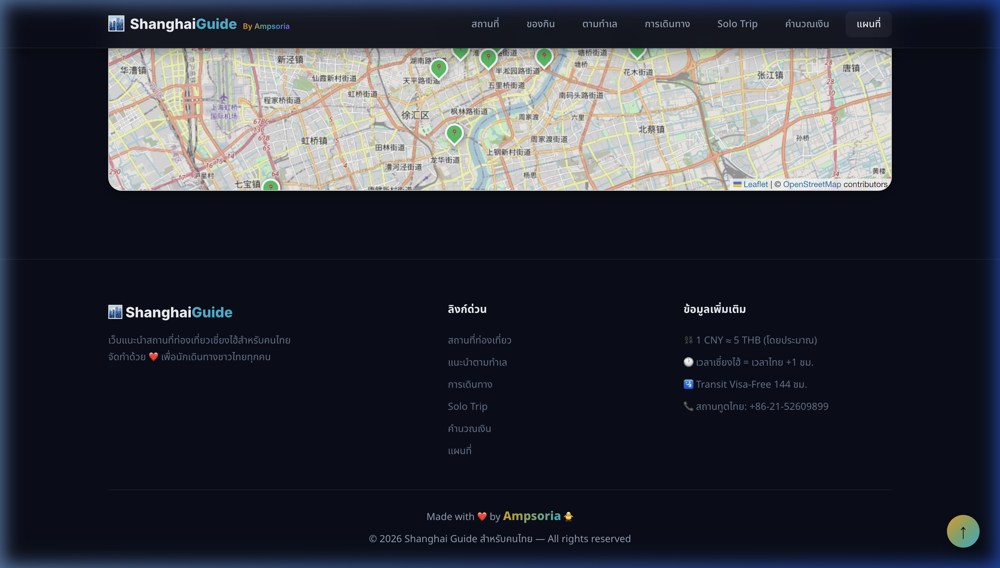

---

## 🛠️ เทคโนโลยีที่ใช้

| Technology | Purpose |
|-----------|---------|
| HTML5 | โครงสร้างเว็บ |
| CSS3 | Dark Theme + Glassmorphism + Animations |
| Vanilla JavaScript | Logic ทั้งหมด (กรอง, แนะนำ, คำนวณ, แปลภาษา) |
| Leaflet.js | แผนที่ Interactive |
| LocalStorage | จำ Checklist + วันเดินทาง |
| Google Fonts | Typography (Inter + Noto Sans Thai) |

---

## 🚀 วิธีใช้งาน

```bash
git clone https://github.com/Ampsoria/Shanghai_Solotrip_Guideweb.git
open index.html
```

> 💡 ไม่ต้องติดตั้งอะไรเพิ่มเติม เป็น Static Website 100%

---

## 📱 Responsive Design

| Breakpoint | Device |
|-----------|--------|
| `> 768px` | 💻 Desktop |
| `≤ 768px` | 📱 Tablet |
| `≤ 480px` | 📱 iPhone |
| `≤ 375px` | 📱 iPhone SE / Mini |

---

## 👤 ผู้จัดทำ

**Made with ❤️ by Ampsoria 🐥**

© 2026 Shanghai Guide สำหรับคนไทย — All rights reserved
